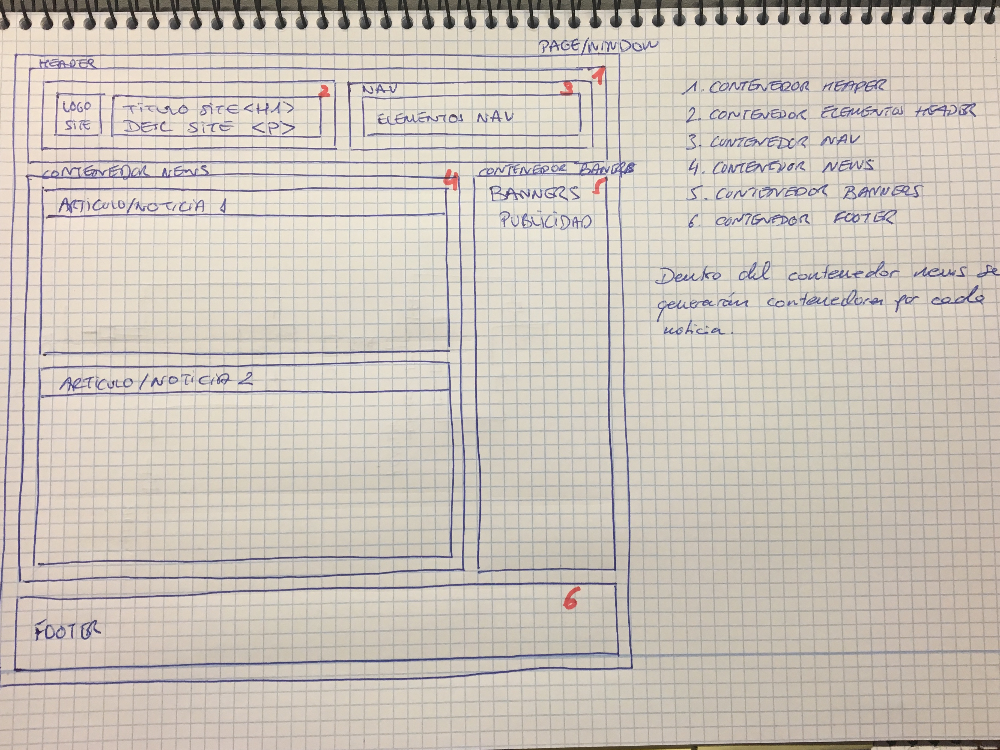
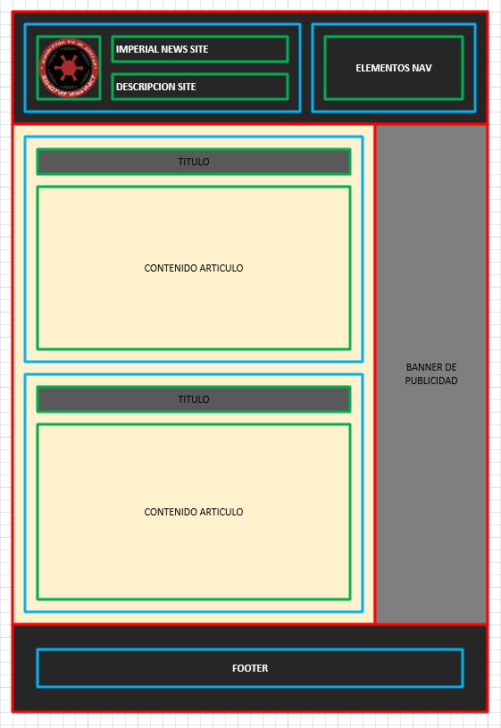
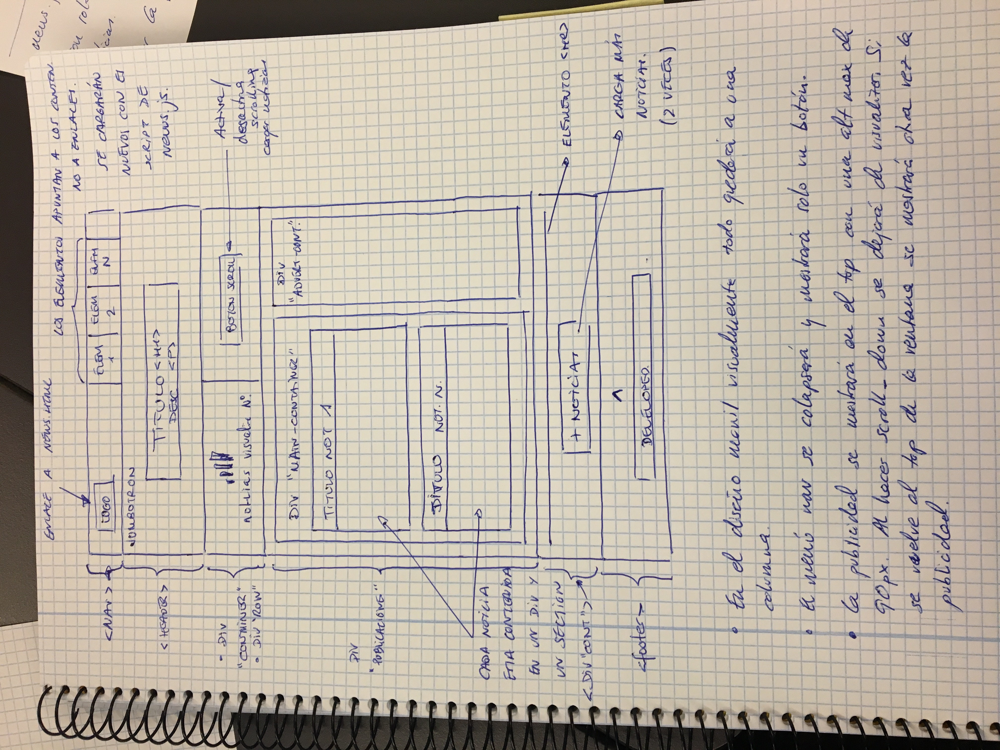
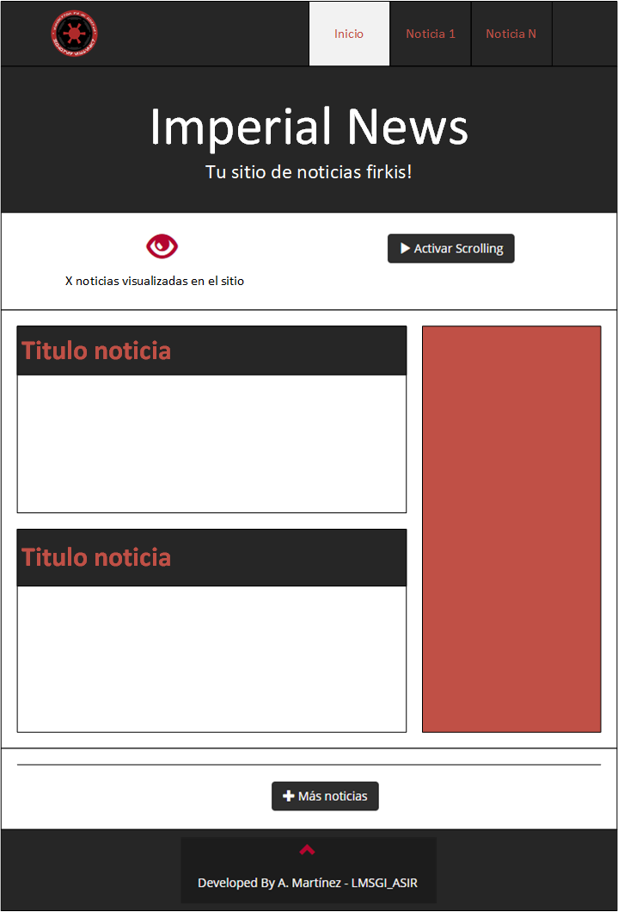

# Proyecto final LMSGI #

Página web de noticias auto rellenable con scroll (Bootstrap, jQuery, Json, HTML).
 
## Implementación ##

### Idea inicial ###
Se realiza un primer esquema de la idea sobre el papel.

### Diseño escritorio ###
Se idea el esquema con varios contenedores el diseño de escritorio.

Despues de este diseño se deriva a la siguiente estructura en el diseño del layout.

Los contenedores son:

 1. Contenedor Header.
 2. Contenedor para los elementos del header:
   * Contenedor del título y logo.
   * Contenedor NAV.
 3. Contenedor Contenido:
   * Contenedor Publicaciones / NEWS.
     * Contenedores para cada articulo/noticia.
   * Contenedor Banners publicidad.
 4. Contenedor Footer.
 
Por lo que el Contenedor 1 ocupara todo el ancho de la pantalla. Dentro tendra 2 subcontenedores el cual los porcentajes seran un 70% (logo y título) y 30% el contenedor de navegación.

Contenedor de Contenido se dividirá en 2 columnas. La principal (publicaciones) ocupara el total de la pantalla menos 300 px que seran dedicados al contenedor del banner (en el dispositivo móvil esto cambiará).

Finalmente tenemos el último contenedor que sera el footer. Ocupará toda la pantalla.

Al proceder a la implementación y revisando el tutorial de Bootstrap en w3schools (https://www.w3schools.com/bootstrap/bootstrap_ref_all_classes.asp) realizo un cambio en la esquematización inicial. Tomando como ejemplo el template de Bootstrap Theme "Company".

Por lo que el diseño deriva al siguiente y se establece como el final:

Una vez ideada la maquetación la genero con visio para tener un documento gráfico.

#### Diseño de escritorio ###
El banner para pantallas de 768px a 922px tendra una dimensión de 200px de ancho. para pantallas superiores a 922px el ancho del banner será de 300px.

#### Diseño de movil ###
Cuando el scrolling no se encuentre en el top de la ventana no se mostrara la publicidad. El menú aparece contraido en un boton y se visualizara pulsando sobre él.

Cuando el scrolling esté en el top se visualizará el banner de publicidad con una altura de 90px. Se ocultara cuando se haga scrolling hacia abajo y cuando se vuelva al top de la ventana se volverá a visualizar.

Diseño final visualizarlo en https://rawgit.com/am4rtinez/news-lmsgi07/master/news.html.

### Banner publicidad ###
Comprobado que si se tiene un bloqueador de publididad (tipo AdBlock) el elemento del banner no se visualiza.

### Scrolling y botón cargar más noticias ###

Se habilita un elemento button para Activar el scrolling (tambien desactivar) y cargar más noticias. Realizará 2 cargas. El 1.json y el 2.json.

Si se habilita el scrolling cada vez que se se llegue al final de la ventana cargara las nuevas noticias (hasta 2 veces). Una vez realizadas las 2 cargas el boton de más noticias desaparecerá. Se visualizara también en el contenedor de stats el número de noticicas mostradas.

### Inicialización ###
Por defecto se cargan 3 noticias. Las 2 primeras enlazan a news1.xtml y news2.html.

### Validación de los ficheros con: ###
	* https://validator.w3.org/nu
	* http://codebeautify.org/jsonvalidator
	* https://validator.w3.org/feed/
	* https://jigsaw.w3.org/css-validator/

### Otros ###
Las noticias han sido obtenidas de los siguientes enlaces:

  * https://www.vidaextra.com/fps/todo-lo-que-necesitas-saber-sobre-star-wars-battlefront-2
  * http://prensaimperial.com/2017/05/spoiler-revelan-nombre-tendrian-los-caballos-espaciales-del-episodio-viii/
  * http://prensaimperial.com/2017/04/ea-escucho-fuerte-claro-la-comunidad-star-wars-battlefront-nuevos-detalles-del-juego/
  * http://www.hobbyconsolas.com/noticias/star-wars-8-ultimos-jedi-collar-luke-esconde-secreto-rumor-96556
  * https://www.xataka.com/ciencia-ficcion/una-star-wars-muy-real-cuando-la-fuerza-te-acompana-hasta-construir-cazas-o-pensar-en-la-fisica-del-sable-laser
  * http://cultura.elpais.com/cultura/2017/05/03/actualidad/1493818669_416939.html
  * http://www.vandal.net/noticia/1350690933/star-wars-battlefront-ii-ofreceria-compatibilidad-con-playstation-vr-en-ps4/
  * http://www.lacapital.com.ar/escenario/un-nuevo-comienzo-star-wars-pero-la-princesa-leia-n1392567.html
  * http://www.culturaocio.com/cine/noticia-director-ultimos-jedi-pidio-cambiar-final-despertar-fuerza-20170505120105.html
  * http://computerhoy.com/noticias/zona-gaming/star-wars-battlefront-2-tendra-modo-campana-todos-detalles-57876
